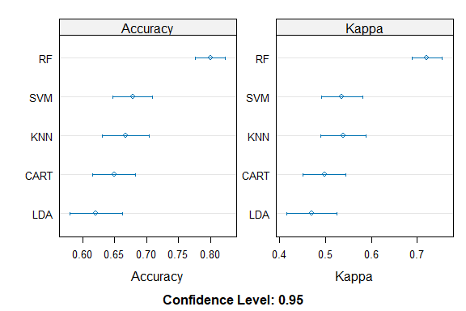

Business Intelligence Lab Submission Markdown
================
Lumin
06/11/23

- [Student Details](#student-details)
- [Setup Chunk](#setup-chunk)
- [1: Install and Load Required
  Packages](#1-install-and-load-required-packages)
- [2. Load the Dataset](#2-load-the-dataset)
- [3. Check for Missing Data and Address
  it](#3-check-for-missing-data-and-address-it)
- [4.The Resamples Function](#4the-resamples-function)
- [5. Display the Results](#5-display-the-results)

# Student Details

<table style="width:99%;">
<colgroup>
<col style="width: 32%" />
<col style="width: 63%" />
<col style="width: 3%" />
</colgroup>
<tbody>
<tr class="odd">
<td><strong>Student ID Numbers and Names of Group Members</strong></td>
<td colspan="2"><pre><code>                                                                                                 |</code></pre>
<ol type="1">
<li>112827 - A - Mungai Kenneth | |</li>
<li>123324 - B - Kelly Noella Sota | |</li>
<li>134265 - A - Emmanuel Kiptoo | | | | |</li>
</ol></td>
</tr>
<tr class="even">
<td><strong>GitHub Classroom Group Name</strong></td>
<td colspan="2">Lumin</td>
</tr>
<tr class="odd">
<td><strong>Course Code</strong></td>
<td>BBT4206</td>
<td></td>
</tr>
<tr class="even">
<td><strong>Course Name</strong></td>
<td>Business Intelligence II</td>
<td></td>
</tr>
<tr class="odd">
<td><strong>Program</strong></td>
<td>Bachelor of Business Information Technology</td>
<td></td>
</tr>
<tr class="even">
<td><strong>Semester Duration</strong></td>
<td>21<sup>st</sup> August 2023 to 28<sup>th</sup> November 2023</td>
<td></td>
</tr>
</tbody>
</table>

# Setup Chunk

**Note:** the following “*KnitR*” options have been set as the
defaults:  
`knitr::opts_chunk$set(echo = TRUE, warning = FALSE, eval = TRUE, collapse = FALSE, tidy.opts = list(width.cutoff = 80), tidy = TRUE)`.

More KnitR options are documented here
<https://bookdown.org/yihui/rmarkdown-cookbook/chunk-options.html> and
here <https://yihui.org/knitr/options/>.

**Note:** the following “*R Markdown*” options have been set as the
defaults:

> output:  
>   
> github_document:  
> toc: yes  
> toc_depth: 4  
> fig_width: 6  
> fig_height: 4  
> df_print: default  
>   
> editor_options:  
> chunk_output_type: console

# 1: Install and Load Required Packages

In this step, we ensure that the necessary R packages are installed and
loaded. Packages are collections of R functions, data, and compiled code
that extend the functionality of R. The install.packages() function is
used to install packages, and library() is used to load them.

``` r
## mlbench ----
if (require("mlbench")) {
    require("mlbench")
} else {
    install.packages("mlbench", dependencies = TRUE, repos = "https://cloud.r-project.org")
}
```

    ## Loading required package: mlbench

``` r
## caret ----
if (require("caret")) {
    require("caret")
} else {
    install.packages("caret", dependencies = TRUE, repos = "https://cloud.r-project.org")
}
```

    ## Loading required package: caret

    ## Loading required package: ggplot2

    ## Loading required package: lattice

``` r
## kernlab ----
if (require("kernlab")) {
    require("kernlab")
} else {
    install.packages("kernlab", dependencies = TRUE, repos = "https://cloud.r-project.org")
}
```

    ## Loading required package: kernlab

    ## 
    ## Attaching package: 'kernlab'

    ## The following object is masked from 'package:ggplot2':
    ## 
    ##     alpha

``` r
## randomForest ----
if (require("randomForest")) {
    require("randomForest")
} else {
    install.packages("randomForest", dependencies = TRUE, repos = "https://cloud.r-project.org")
}
```

    ## Loading required package: randomForest

    ## randomForest 4.7-1.1

    ## Type rfNews() to see new features/changes/bug fixes.

    ## 
    ## Attaching package: 'randomForest'

    ## The following object is masked from 'package:ggplot2':
    ## 
    ##     margin

``` r
## naniar ----
if (require("naniar")) {
    require("naniar")
} else {
    install.packages("naniar", dependencies = TRUE, repos = "https://cloud.r-project.org")
}
```

    ## Loading required package: naniar

# 2. Load the Dataset

This code snippet is used to load the dataset “Glass” contained in the
mlbench package.

``` r
data("Glass")
```

# 3. Check for Missing Data and Address it

This code checks if there are any missing values.

``` r
# Are there missing values in the dataset?
any_na(Glass)
```

    ## [1] FALSE

# 4.The Resamples Function

This code trains five machine learning models (LDA, CART, KNN, SVM, and
Random Forest) on the “Glass” dataset. It uses cross-validation and
collects performance metrics like accuracy and RMSE. The goal is to
compare the models’ performance.

``` r
## 4.a. Train the Models ---- We train the following models, all of which are
## using 10-fold repeated cross validation with 3 repeats: LDA CART KNN SVM
## Random Forest


train_control <- trainControl(method = "repeatedcv", number = 10, repeats = 3)


### LDA ----
set.seed(7)
GlassModel_lda <- train(Type ~ ., data = Glass, method = "lda", trControl = train_control)


### CART ----
set.seed(7)
GlassModel_cart <- train(Type ~ ., data = Glass, method = "rpart", trControl = train_control)

### KNN ----
set.seed(7)
GlassModel_knn <- train(Type ~ ., data = Glass, method = "knn", trControl = train_control)

### SVM ----
set.seed(7)
GlassModel_svm <- train(Type ~ ., data = Glass, method = "svmRadial", trControl = train_control)


### Random Forest ----
set.seed(7)
GlassModel_rf <- train(Type ~ ., data = Glass, method = "rf", trControl = train_control)


## 4.b. Call the `resamples` Function ---- We then create a list of the model
## results and pass the list as an argument to the `resamples` function.

results <- resamples(list(LDA = GlassModel_lda, CART = GlassModel_cart, KNN = GlassModel_knn,
    SVM = GlassModel_svm, RF = GlassModel_rf))
```

# 5. Display the Results

This code does different analyses and visualizations to evaluate machine
learning models. It includes a summary table, plots, and statistical
tests to compare model performance.

``` r
## 1. Table Summary ---- This is the simplest comparison. It creates a table
## with one model per row and its corresponding evaluation metrics displayed
## per column.

summary(results)
```

    ## 
    ## Call:
    ## summary.resamples(object = results)
    ## 
    ## Models: LDA, CART, KNN, SVM, RF 
    ## Number of resamples: 30 
    ## 
    ## Accuracy 
    ##           Min.   1st Qu.    Median      Mean   3rd Qu.      Max. NA's
    ## LDA  0.3636364 0.5454545 0.6277056 0.6212071 0.6916667 0.9047619    0
    ## CART 0.4545455 0.6190476 0.6363636 0.6493475 0.7142857 0.8181818    0
    ## KNN  0.3809524 0.6190476 0.6742424 0.6672596 0.7443182 0.9047619    0
    ## SVM  0.4761905 0.6363636 0.6666667 0.6783581 0.7142857 0.8571429    0
    ## RF   0.6521739 0.7727273 0.8095238 0.7995313 0.8420455 0.9090909    0
    ## 
    ## Kappa 
    ##           Min.   1st Qu.    Median      Mean   3rd Qu.      Max. NA's
    ## LDA  0.1561644 0.3659318 0.4813037 0.4706998 0.5636423 0.8636364    0
    ## CART 0.1975684 0.4421330 0.4962492 0.4978139 0.5775276 0.7341390    0
    ## KNN  0.1574074 0.4631516 0.5446795 0.5395413 0.6337050 0.8707692    0
    ## SVM  0.2300000 0.4743722 0.5234895 0.5362700 0.5971656 0.7980769    0
    ## RF   0.5183246 0.6820494 0.7345965 0.7215597 0.7735402 0.8770950    0

``` r
## 2. Box and Whisker Plot ---- This is useful for visually observing the
## spread of the estimated accuracies for different algorithms and how they
## relate.

scales <- list(x = list(relation = "free"), y = list(relation = "free"))
bwplot(results, scales = scales)
```

<!-- -->

``` r
## 3. Dot Plots ---- They show both the mean estimated accuracy as well as the
## 95% confidence interval.

scales <- list(x = list(relation = "free"), y = list(relation = "free"))
dotplot(results, scales = scales)
```

<!-- -->

``` r
## 4. Scatter Plot Matrix ---- This is useful when considering whether the
## predictions from two different algorithms are correlated. If weakly
## correlated, then they are good candidates for being combined in an ensemble
## prediction.

splom(results)
```

<!-- -->

``` r
## 5. Pairwise xyPlots ---- You can zoom in on one pairwise comparison of the
## accuracy of trial-folds for two models using an xyplot.

# xyplot plots to compare models
xyplot(results, models = c("LDA", "SVM"))
```

<!-- -->

``` r
# or xyplot plots to compare models
xyplot(results, models = c("SVM", "CART"))
```

<!-- -->

``` r
## 6. Statistical Significance Tests ---- This is used to calculate the
## significance of the differences between the metric distributions of the
## various models.

### Upper Diagonal ---- The upper diagonal of the table shows the estimated
### difference between the distributions. If we think that LDA is the most
### accurate model from looking at the previous graphs, we can get an estimate
### of how much better it is than specific other models in terms of absolute
### accuracy.

### Lower Diagonal ---- The lower diagonal contains p-values of the null
### hypothesis.  The null hypothesis is a claim that 'the distributions are the
### same'.  A lower p-value is better (more significant).

diffs <- diff(results)

summary(diffs)
```

    ## 
    ## Call:
    ## summary.diff.resamples(object = diffs)
    ## 
    ## p-value adjustment: bonferroni 
    ## Upper diagonal: estimates of the difference
    ## Lower diagonal: p-value for H0: difference = 0
    ## 
    ## Accuracy 
    ##      LDA       CART      KNN       SVM       RF      
    ## LDA            -0.02814  -0.04605  -0.05715  -0.17832
    ## CART 1.00000             -0.01791  -0.02901  -0.15018
    ## KNN  0.64749   1.00000             -0.01110  -0.13227
    ## SVM  0.05278   0.74818   1.00000             -0.12117
    ## RF   2.810e-11 1.632e-09 5.278e-07 9.582e-12         
    ## 
    ## Kappa 
    ##      LDA       CART      KNN       SVM       RF       
    ## LDA            -0.027114 -0.068842 -0.065570 -0.250860
    ## CART 1.0000              -0.041727 -0.038456 -0.223746
    ## KNN  0.5062    1.0000               0.003271 -0.182018
    ## SVM  0.1861    1.0000    1.0000              -0.185290
    ## RF   1.609e-11 8.925e-10 5.647e-07 1.470e-12
